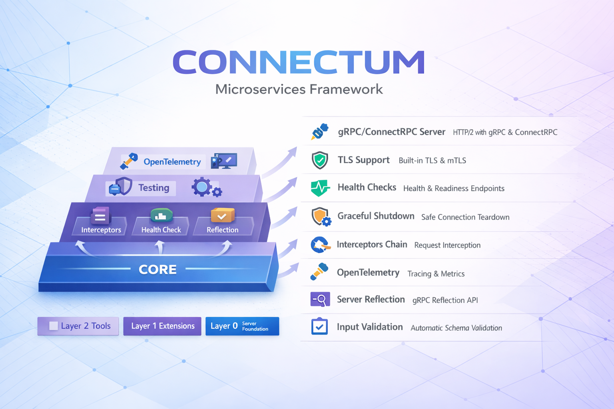

<a href="https://connectum.dev">
<picture>
  <source media="(prefers-color-scheme: dark)" srcset="../assets/splash-dark.png">
  <source media="(prefers-color-scheme: light)" srcset="../assets/splash.png">
  
</picture>
</a>

 

**Minimalist Node.js framework for production-ready gRPC/ConnectRPC microservices**

 

&nbsp;

## Core Principles

1. **Minimalist** — Zero bloat, only essential abstractions. No unnecessary layers between you and the platform.
2. **Cloud Native** — Built for Kubernetes, service mesh, control plane, zero trust, and IdP integration from day one.
3. **gRPC/ConnectRPC Ecosystem** — First-class support for Protocol Buffers, gRPC, and ConnectRPC with modern Node.js patterns.
4. **Strict Separation of Concerns** — Clean layered architecture. Each package does one thing well.
5. **Non-Opinionated** — No forced ORM, message broker, or specific libraries. Bring your own Kafka, NATS, Prisma, or Drizzle. Easy migration of existing codebases.

&nbsp;

## Why Connectum

Modern enterprise infrastructure is built on service mesh, control plane, Kubernetes, zero trust, Identity Providers, and other technologies that impose their own requirements on software for native and seamless integration of all components.

Connectum provides tools for native and seamless development with these concepts. It doesn't reinvent the wheel. It bridges the gap between your Node.js application and the cloud-native ecosystem, giving you production-grade primitives without locking you into specific choices.

Native TypeScript execution through Node.js 25.2.0+ type stripping means zero build step, instant startup, and simplified CI/CD — your TypeScript runs directly, as it should.

&nbsp;

## Architecture

 

&nbsp;

## Links

| | Resource | |
|---|---|---|
| :book: | **Documentation** | [connectum.dev](https://connectum.dev) |
| :package: | **Framework** | [Connectum-Framework/connectum](https://github.com/Connectum-Framework/connectum) |
| :bulb: | **Examples** | [Connectum-Framework/examples](https://github.com/Connectum-Framework/examples) |
| :world_map: | **Roadmap** | [Project Board](https://github.com/orgs/Connectum-Framework/projects/1) |

&nbsp;

---

**Apache 2.0** — Built with love by [Highload.Zone](https://highload.zone)

